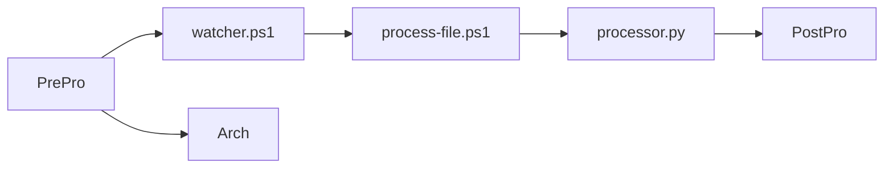

# 🌊 ETL Pipeline with PowerShell + Python

This project implements a simple **ETL (Extract – Transform – Load)** pipeline using a PowerShell watcher that detects incoming files, processes them with a Python script, and saves the output automatically.

---

## 📁 Repository Structure

```
├── PrePro/              # Input folder (files to be processed) - Empty folder to be created
├── PostPro/             # Output folder (processed files) - Empty folder to be created
├── Arch/                # Backup/archive folder - Empty folder to be created
├── process-file.ps1     # Script that processes each detected file
├── watcher.ps1          # Daemon that monitors the PrePro folder
├── dummy_production.py  # Python script invoked by process-file.ps1
├── watcher.log          # Log file with watcher events and errors
└── dummy_files/         # Example .txt files for testing - It comes with 4 examples
```

---

## ⚙️ Configuration

### 1. Edit paths in the `.ps1` files

Modify the path parameters in both `watcher.ps1` and `process-file.ps1` to match your directory structure. If you need to process a different file format, update the file extension filters in both daemon and process scripts.

### 2. Customize the Python script

The Python script (`dummy_production.py`) is invoked from `process-file.ps1`. By default, it performs text sorting for noisy text files. Adjust the transformation logic, data format, and processing steps according to your specific use case.

---

## 🔍 How It Works

1. **Detection:** `watcher.ps1` monitors the `PrePro` folder for new files
2. **Processing:** When a file is detected, `process-file.ps1` is triggered
3. **Transformation:** The Python script `processor.py` performs the data transformation
4. **Output:** Processed files are saved to `PostPro`
5. **Archive:** Original files are moved to `Arch` for backup

## ▶️ Execution

To start the watcher daemon in the background:

```powershell
cd C:\Users\<user>\Documents\wherever\u\save\this
powershell -ExecutionPolicy Bypass -File .\watcher.ps1
```

Once the watcher is running, move your target files to the `PrePro` folder. Processed files will appear in `PostPro`, while originals will be archived in `Arch`.

---

## 📌 Notes

- Run the watcher in a dedicated PowerShell session and keep it open during execution, as it's designed to run as a Windows daemon in the background
- To stop the watcher, press `Ctrl + C` in the PowerShell window
- Check `watcher.log` for audit trails and troubleshooting information

---

## 🍅 Feedback

Comments and feedback are greatly appreciated! This is a rudimentary deployment and there's always room for improvement.

🍅🍅🍅
